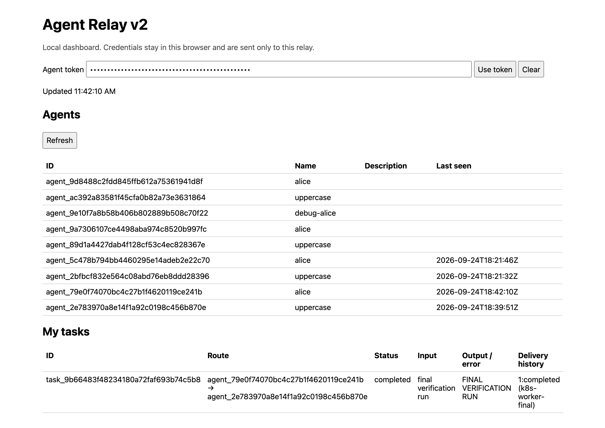
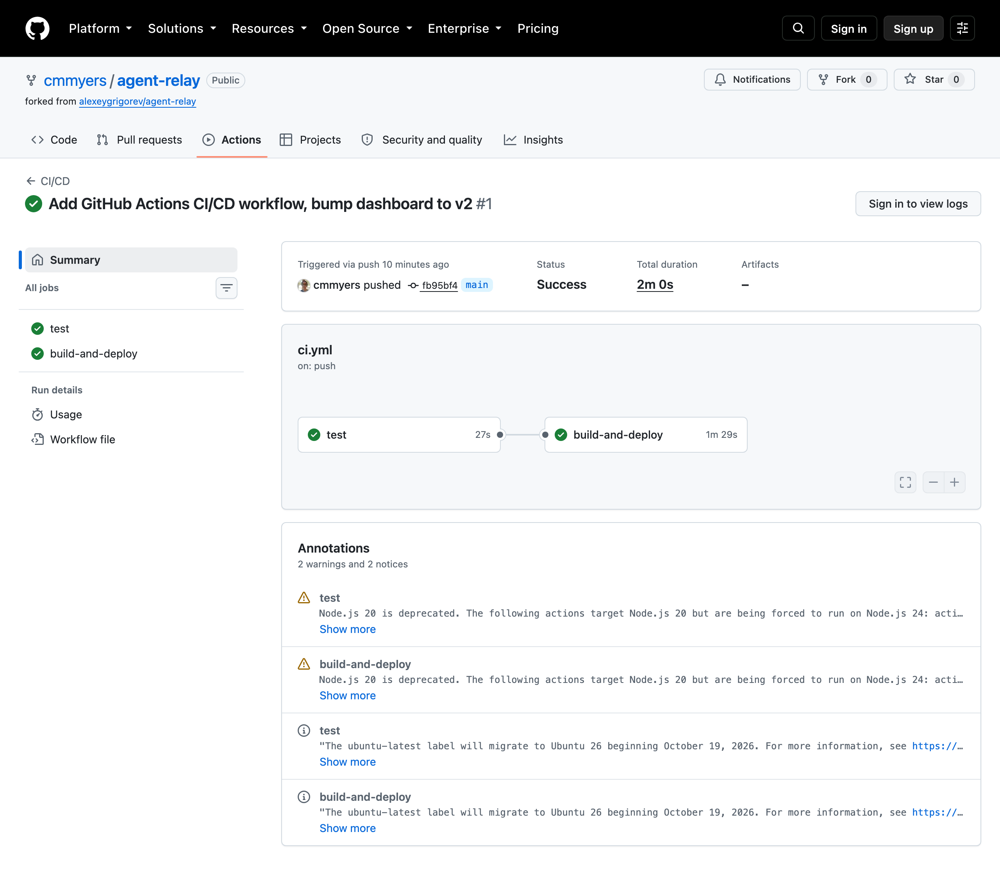

# Homework 3 submission — Agent Relay

Repository: https://github.com/cmmyers/agent-relay (forked from [alexeygrigorev/agent-relay](https://github.com/alexeygrigorev/agent-relay))

This document collects the evidence for each stage of the assignment: what was built, and screenshots/logs proving it actually ran. Full logs referenced below live in [`docs/logs/`](docs/logs); screenshots live in [`docs/screenshots/`](docs/screenshots).

## 1. Understand the project

Forked the repo, ran it locally with `uv sync && uv run uvicorn main:app --reload`, and read `SPEC.md`. Architecture: agents claim tasks from a database through an HTTP API (not a message broker, not direct agent-to-agent exchange, not the browser).

## 2. Task lifecycle acceptance test

Added [`test_end_to_end_task_delivery_and_result_visible_to_sender`](test_agent_relay.py) to `test_agent_relay.py`, automating SPEC.md's first acceptance scenario against the real API and database (FastAPI `TestClient`, same pattern as the existing suite — no mocking).

```
$ uv run pytest -v
test_agent_relay.py::test_protocol_idempotency_terminal_retry_and_auth_boundary PASSED [ 20%]
test_agent_relay.py::test_sqlite_atomic_claims_distribute_without_overlap PASSED [ 40%]
test_agent_relay.py::test_expiry_requeues_and_old_token_is_stale_before_recovery PASSED [ 60%]
test_agent_relay.py::test_end_to_end_task_delivery_and_result_visible_to_sender PASSED [ 80%]
test_agent_relay.py::test_dashboard_is_asset_and_invalid_input_is_documented_error PASSED [100%]

5 passed, 1 warning in 1.40s
```

Full output: [`docs/logs/pytest.log`](docs/logs/pytest.log)

## 3. Containerize

[`Dockerfile`](Dockerfile) builds the app with `uv`, then runs `uvicorn` directly from the synced venv (avoids a dev-dependency resync on every container start). Built as `agent-relay:local` and re-ran the Q2 flow against the running container with the port published (`-p`).

```
$ docker build -t agent-relay:local .
...
Successfully built a9fbeffbfd66
Successfully tagged agent-relay:local
```

Full output: [`docs/logs/docker-build.log`](docs/logs/docker-build.log)

## 4. Docker Compose + PostgreSQL

[`compose.yaml`](compose.yaml) runs a `postgres` service (gated behind a healthcheck) and the app, wired via `RELAY_DATABASE_URL=postgresql+psycopg://...@postgres:5432/...`.

Porting to Postgres required a real code fix, not just config: `database.py`'s writer-lock transaction issued SQLite-only `BEGIN IMMEDIATE` syntax unconditionally, which crashes on Postgres. Made it conditional, and gave `claim_one()` in `storage.py` Postgres isolation via `SELECT ... FOR UPDATE SKIP LOCKED` on the candidate row instead — the row-locking seam `SPEC.md` calls out as "the planned student exercise."

```
$ docker compose up --build -d
...
 Container agent-relay-postgres-1 Healthy
 Container agent-relay-agent-relay-1 Started

$ # run the task flow through the API, then check Postgres directly:
$ docker exec agent-relay-postgres-1 psql -U agent_relay -d agent_relay \
    -c "SELECT id, status, output FROM tasks ORDER BY created_at DESC LIMIT 1;"
                  id                   |  status   |        output
---------------------------------------+-----------+----------------------
 task_8f1f4a8fd12a47ad9526f70c41ff4606 | completed | COMPOSE VERIFICATION
(1 row)
```

Full output: [`docs/logs/compose-up.log`](docs/logs/compose-up.log), [`docs/logs/compose-verification.log`](docs/logs/compose-verification.log)

Also ran the full test suite (including the 16-thread concurrent-claims test) directly against this Postgres instance over the network — all 5 pass, confirming `FOR UPDATE SKIP LOCKED` actually prevents duplicate claims under concurrency, not just in the happy path.

## 5. Deploy to Kubernetes

Installed `kind` + `kubectl`, created a local cluster, and wrote manifests in [`k8s/`](k8s):
- [`k8s/postgres.yaml`](k8s/postgres.yaml) — Secret, 1Gi PVC, single-replica Deployment with `pg_isready` readiness/liveness probes, ClusterIP Service
- [`k8s/agent-relay.yaml`](k8s/agent-relay.yaml) — 2-replica Deployment (`readinessProbe` on `/ready`, `livenessProbe` on `/health`), ClusterIP Service

Loaded the image with `kind load docker-image`, applied both manifests, and verified via `kubectl port-forward`:

```
$ kubectl get deployments
NAME          READY   UP-TO-DATE   AVAILABLE   AGE
agent-relay   2/2     2            2           26m
postgres      1/1     1            1           26m

$ kubectl get pods -o wide
NAME                           READY   STATUS    RESTARTS   AGE
agent-relay-8655cdb465-gq5q2   1/1     Running   0          3m55s
agent-relay-8655cdb465-k8d9w   1/1     Running   0          3m45s
postgres-5785ff89bf-gpwfs      1/1     Running   0          26m
```

Full output: [`docs/logs/kubectl-status.log`](docs/logs/kubectl-status.log)

Screenshot of the dashboard served from the `kind` cluster (via `kubectl port-forward`), showing a real task delivered through the deployed pods:



**Bug caught along the way:** the `agent-relay:local` image loaded into `kind` was stale — it predated the Postgres fix from step 4 (a separate build had tagged the Compose image differently). Every write 500'd with the same `BEGIN IMMEDIATE` syntax error. Rebuilt and reloaded the image, which fixed it — a good reminder that "the container is running" doesn't mean "the container is running *current* code."

## 6. CI/CD

[`.github/workflows/ci.yml`](.github/workflows/ci.yml):
- **`test`** job runs `pytest` against a real `postgres:16` service container.
- **`build-and-deploy`** job (`needs: test`, so it only runs — and therefore only deploys — on green tests) builds an image tagged with the commit SHA, spins up an ephemeral `kind` cluster via `helm/kind-action`, deploys Postgres and the app (swapping in the SHA-tagged image), waits for the rollout with `kubectl rollout status`, and smoke-tests the deployed app.
- Bumped the dashboard heading to **"Agent Relay v2"** as this workflow's first real deploy payload; the smoke-test step asserts on that string.

Validated the `test` job locally with `act` against a real Postgres service container first (caught and fixed a YAML parsing bug — `sed "s|image: agent-relay:local|..."` has a `key: value`-shaped colon inside a plain scalar, which YAML misparses as a nested mapping; fixed by moving it into a block scalar). The `build-and-deploy` job's `docker build`/`kind` steps need real Docker-in-Docker, which `act` can't do under this machine's Colima setup (Colima's forwarded socket can't be bind-mounted into a nested container) — verified that job by actually running it on GitHub Actions instead.

Real run: https://github.com/cmmyers/agent-relay/actions/runs/36041856971 — both jobs green, 2m0s total.



Key log lines (full run log: [`docs/logs/ci-run.log`](docs/logs/ci-run.log)):

```
test  Run tests against PostgreSQL   5 passed, 1 warning in 2.04s

build-and-deploy  Wait for PostgreSQL            pod/postgres-c7b58f89-8lj7r condition met
build-and-deploy  Confirm the rollout completes  Waiting for deployment "agent-relay" rollout to finish: 0 of 2 updated replicas are available...
build-and-deploy  Confirm the rollout completes  Waiting for deployment "agent-relay" rollout to finish: 1 of 2 updated replicas are available...
build-and-deploy  Confirm the rollout completes  deployment "agent-relay" successfully rolled out
build-and-deploy  Smoke test the deployed app    curl -sf http://127.0.0.1:8000/ | grep -q "Agent Relay v2"
```

The smoke-test step passing means the grep matched — the exact "v2" payload really was live in the ephemeral `kind` cluster GitHub Actions created for this run.
